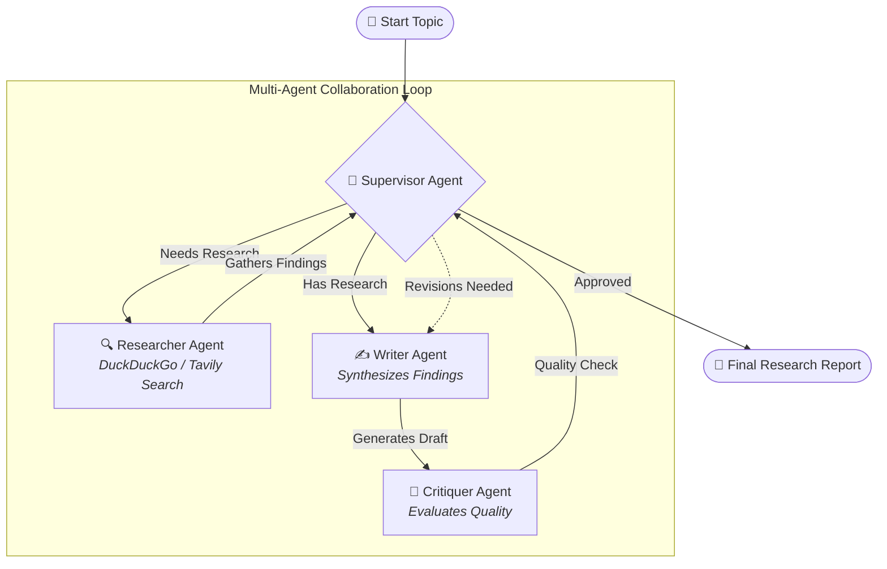

# 🤖 Multi-Agent Knowledge Discovery System

[](https://www.python.org/)
[](https://github.com/langchain-ai/langgraph)
[](https://github.com/langchain-ai/langchain)
[](https://streamlit.io/)
[](https://aistudio.google.com/)
[](https://groq.com/)

A state-of-the-art **collaborative multi-agent research assistant** built with **LangGraph**, **LangChain**, and **Streamlit**. It coordinates specialized AI agents (Supervisor, Researcher, Writer, and Critiquer) to autonomously discover, summarize, draft, and refine high-quality research reports on any topic.

---

## 🌟 Key Features

- **🧠 Autonomous Multi-Agent Architecture**: Built on LangGraph cyclical state graphs for coordinated collaboration.
- **⚡ 100% Free LLM Options**:
  - **Google Gemini**: Flagship `gemini-3.6-flash`, high-speed `gemini-3.5-flash-lite`, and custom model choices.
  - **Groq**: Ultra-fast `llama-3.3-70b-versatile` (500+ tokens/sec).
  - **Together AI**: Open-source models like `Mixtral-8x7B`.
- **🔍 Zero-Key Free Web Search**:
  - **DuckDuckGo**: Live web search integration requiring **0 API keys and $0 cost**.
  - **Tavily Search**: Dedicated AI search provider with raw content extraction.
- **🛡️ Fault-Tolerant & Rate-Limit Resilient**:
  - Automatic exponential backoff and retry for API rate limits (`429 RESOURCE_EXHAUSTED`).
  - Draft and research preservation ensuring no findings are lost during revisions.
- **📊 Modern Interactive Streamlit Dashboard**:
  - Real-time step-by-step agent activity log with expandable preview cards.
  - Live report statistics (Word Count, Character Count, Revisions, Research Sources).
  - Search findings viewer with source citations and one-click `.txt` report downloads.

---

## 🏗️ System Architecture



### Agent Roles:
1. **🎯 Supervisor**: Orchestrates execution state, determines next actions, and finalizes the output.
2. **🔍 Researcher**: Queries the web for current data, articles, and citations without redundant overhead.
3. **✍️ Writer**: Synthesizes multi-source research into comprehensive, structured Markdown reports.
4. **🔎 Critiquer**: Evaluates the report for depth, structure, and factual coherence.

---

## 📁 Project Structure

```text
multi-agent-knowledge-discovery-system/
├── assets/
│   └── research_graph.png      # Workflow architecture diagram
├── tests/
│   └── test_tools.py           # Automated unit tests
├── .env.example                # Environment variables template
├── .gitignore                  # Git ignore rules for keys & venv
├── agents.py                   # Multi-provider LLM & agent definitions
├── app.py                      # Streamlit interactive UI application
├── graph.py                    # LangGraph workflow compilation & state
├── prompts.py                  # System prompts for all agents
├── requirements.txt            # Python dependencies
├── pyproject.toml              # Pytest & project configuration
├── visualize_graph.py          # Script to generate architecture diagram
└── README.md                   # Project documentation
```

---

## 🚀 Quick Start Guide

### 1. Prerequisites
- **Python 3.10 to 3.12** installed on your system.
- Git installed.

### 2. Clone the Repository
```bash
git clone https://github.com/cKumar-pun/multi-agent-knowledge-discovery-system.git
cd multi-agent-knowledge-discovery-system
```

### 3. Create and Activate Virtual Environment

**Windows (PowerShell):**
```powershell
python -m venv .venv
.\.venv\Scripts\Activate.ps1
```

**macOS / Linux:**
```bash
python3 -m venv .venv
source .venv/bin/activate
```

### 4. Install Dependencies
```bash
pip install -r requirements.txt
```

### 5. Configure API Keys (Optional)
Copy `.env.example` to `.env`:
```bash
cp .env.example .env
```
Edit `.env` with your preferred API keys (you can also enter them directly in the Streamlit UI):
```env
# Free Google Gemini API Key: https://aistudio.google.com/app/apikey
GEMINI_API_KEY=your_gemini_key_here

# (Optional) Free Groq API Key: https://console.groq.com/
GROQ_API_KEY=your_groq_key_here

# (Optional) Tavily Search API Key: https://tavily.com/
TAVILY_API_KEY=your_tavily_key_here
```

> 💡 **100% Free Default**: You can use **DuckDuckGo Search** (no key required) with a free **Google Gemini** or **Groq** key without spending anything.

---

## 💻 Running the Application

Launch the Streamlit web dashboard:
```bash
streamlit run app.py
```

Open your browser and navigate to:
```text
http://localhost:8501
```

---

## 🧪 Running Automated Tests

Run the test suite using `pytest`:
```bash
pytest tests/
```

---

## 📊 Generating Architecture Diagram

To generate or update the visual workflow graph:
```bash
python visualize_graph.py
```
The output will be saved to `assets/research_graph.png`.

---

## 🛠️ Tech Stack & Dependencies

- **Orchestration**: [LangGraph](https://github.com/langchain-ai/langgraph), [LangChain](https://github.com/langchain-ai/langchain)
- **LLM Providers**:
  - [`langchain-google-genai`](https://pypi.org/project/langchain-google-genai/) (Gemini 3.6 Flash / 3.5 Flash Lite)
  - [`langchain-groq`](https://pypi.org/project/langchain-groq/) (LLaMA 3.3 70B)
  - [`langchain-together`](https://pypi.org/project/langchain-together/)
- **Search Engines**:
  - `duckduckgo-search` / `ddgs` (Zero-key web search)
  - `langchain-tavily`
- **UI Framework**: [Streamlit](https://streamlit.io/)

---

## 📄 License

This project is open-source and available under the [MIT License](LICENSE).
